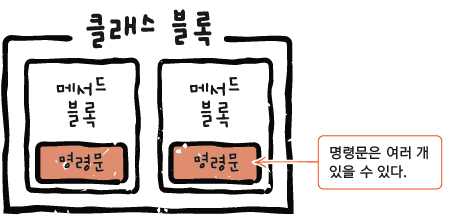

## 02장 자바 시작하기

02-01 자바 코드 구조 살펴보기
자바는 클래스(class) 기반의 객체지향 프로그래밍 언어입니다. 각 클래스는 중괄호 {} 로 둘러싸인 메서드(method)와 변수(variable)들로 이루어져 있습니다. 메서드는 클래스 내에서 특정한 기능을 수행하는 코드 블록을 의미하며, 변수는 값을 저장하기 위한 메모리 공간을 가리킵니다. 자바 코드는 보통 main 메서드부터 실행되며, 이는 프로그램의 시작점을 나타냅니다.

02-02 변수와 자료형
변수는 프로그램에서 데이터를 저장하고 조작하기 위한 가장 기본적인 수단입니다. 자바에서는 변수를 선언하고 초기화하여 사용합니다. 변수의 자료형은 그 변수가 어떤 종류의 데이터를 저장할 수 있는지를 결정합니다. 예를 들어, 정수를 저장할 때에는 int 혹은 long과 같은 정수형 자료형을 사용하고, 실수를 저장할 때에는 float 혹은 double과 같은 실수형 자료형을 사용합니다. 또한, 문자를 저장할 때에는 char, 참과 거짓을 저장할 때에는 boolean 자료형을 사용합니다.

02-03 이름 짓는 규칙
자바에서는 변수, 메서드, 클래스 등을 정의할 때 일정한 명명 규칙을 따라야 합니다. 변수명은 소문자로 시작하며, 여러 단어로 이루어진 경우에는 각 단어의 첫 글자를 대문자로 표기하는 카멜 표기법(camelCase)을 따릅니다. 클래스명은 대문자로 시작하며, 여러 단어로 이루어진 경우에도 카멜 표기법을 사용합니다. 이러한 명명 규칙을 준수함으로써 코드의 가독성을 높일 수 있습니다.

